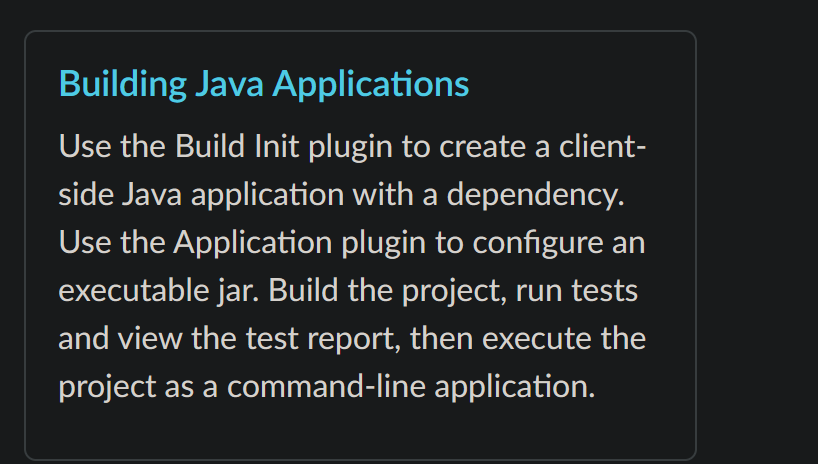
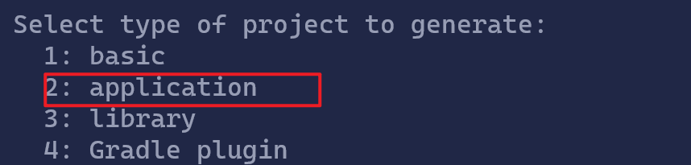
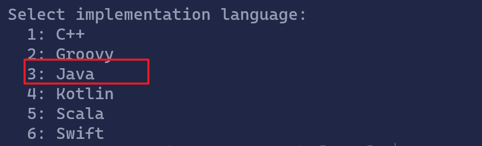
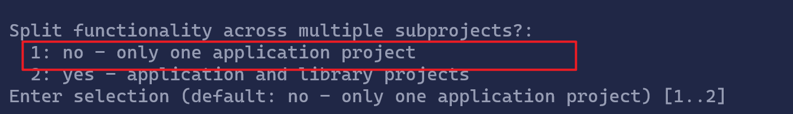
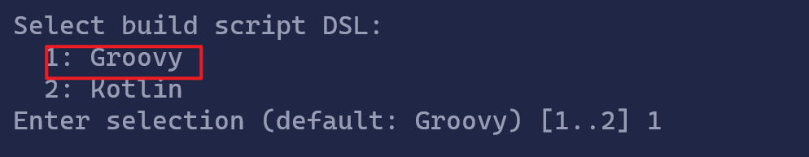
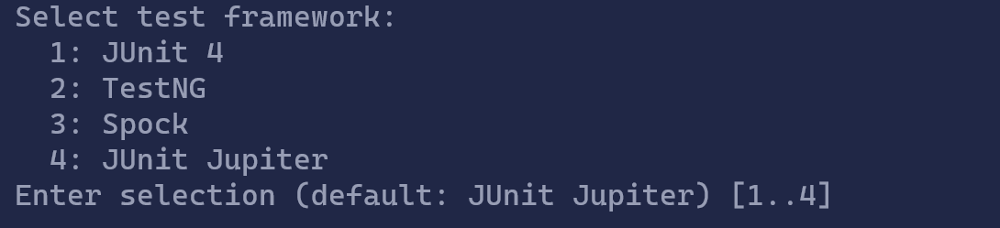
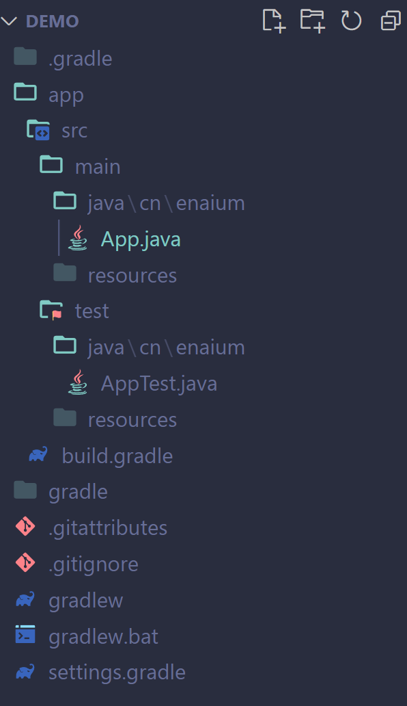
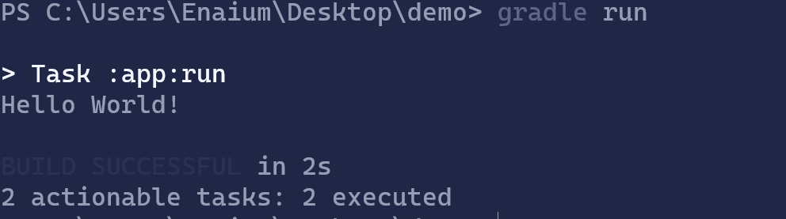

#  第二期

[Gradle指南](https://gradle.org/guides/)



选择Java应用程序

```shell
mkdir demo
cd demo
```

创建一个demo目录

运行`gradle init`命令创建Gradle项目



选择`application`



选择`Java`



默认



选择Groovy


默认



默认


项目名称和包名



目录结构

其中`setttings.gradle`文件

```groovy
rootProject.name = 'demo'//项目名称
include('app')//包含的项目(子项目)
```

`build.gradle`为主要gradle项目文件

```groovy
plugins {
    // Apply the application plugin to add support for building a CLI application in Java.
    id 'application'//gradle的插件
}

repositories {
    // Use Maven Central for resolving dependencies.
    mavenCentral()//使用Maven仓库
}

dependencies {
    // Use JUnit Jupiter for testing.
    testImplementation 'org.junit.jupiter:junit-jupiter:5.8.1'//单元测试的依赖

    // This dependency is used by the application.
    implementation 'com.google.guava:guava:30.1.1-jre'//项目依赖
}

application {
    // Define the main class for the application.
    mainClass = 'cn.enaium.App'//主类
}

tasks.named('test') {
    // Use JUnit Platform for unit tests.
    useJUnitPlatform()//使用JUnit单元测试
}
```

src里面为源文件

使用`./gradlew run`命令运行项目



可以使用`gradle run --args="123"`来给运行的项目添加运行参数

结束

