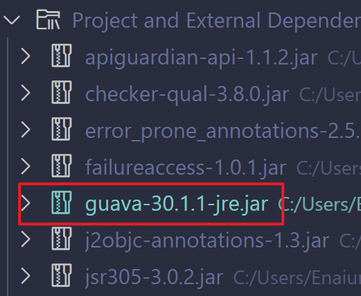

# 第三期

```groovy
repositories {
    mavenCentral()
}
```

Maven中央仓库

```groovy
repositories {
    google()
}
```

Google的Maven仓库

```groovy
repositories {
    mavenCentral()
    maven {
        url "https://repo.spring.io/release"
    }
    maven {
        url "https://repository.jboss.org/maven2"
    }
}
```

可以同时存在多个仓库

```groovy
repositories {
    maven {
        url "http://repo.mycompany.com/maven2"
    }
}
```

自定义Maven仓库的地址


## 依赖

用`dependencies`包住

`implementation`普通依赖,在主模块,测试模块,编译时,运行时等等都存在的依赖

`testImplementation`测试依赖,只有在测试模块中才可以使用

`compileOnly`编译时存在的依赖

`runtimeOnly`运行时存在的依赖

依赖的名称(简写)

`com.google.guava:guava:30.1.1-jre`

用冒号隔开,第一个位置是`group`,第二个位置是名称,第三个位置是版本号

`  implementation group:'com.google.guava',name:'guava',version:'30.1.1-jre'`

完整版为

对应的依赖的下载地址就是,把`.`给换成`/`,冒号也是

先会获取到依赖的`pom`文件获取到是否有其他依赖或者其他信息等等

```xml
<parent>
<groupId>com.google.guava</groupId>
<artifactId>guava-parent</artifactId>
<version>30.1.1-jre</version>
</parent>
```

`groupId`就是包名

`artifactId`就是名称

`version`就是版本

`dependencies`里就是该依赖的子依赖,依赖了也会把子依赖一起下载依赖



结束


